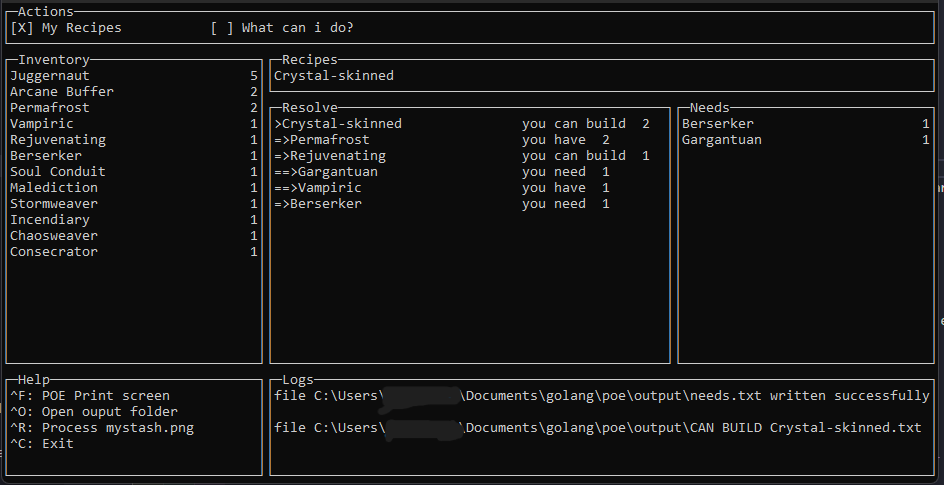
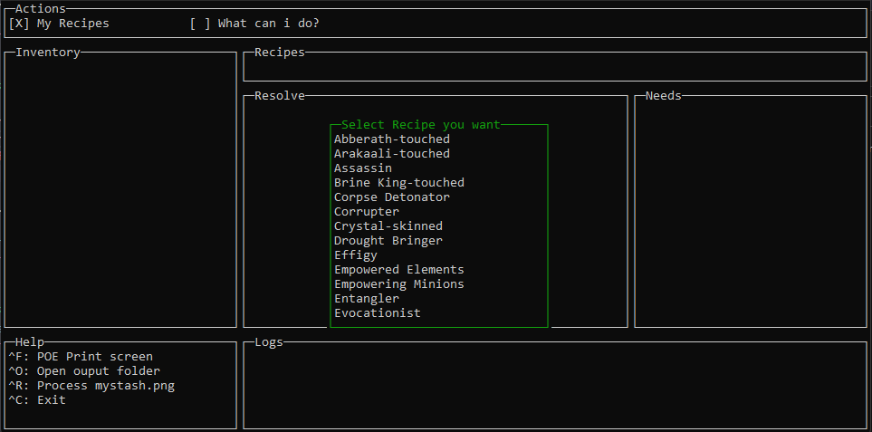
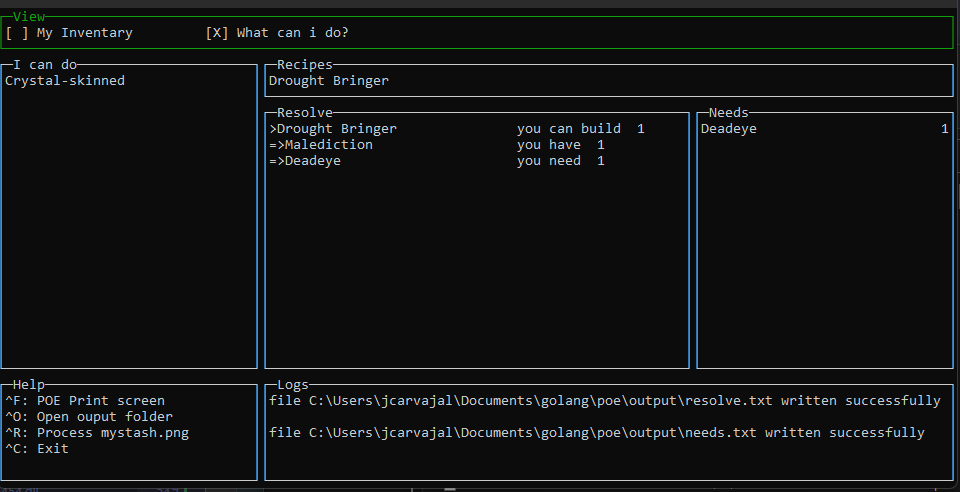

# Features

## General

## Select Recipe

## What can i do with my inventory

## Build for debugging
go build -gcflags=all="-N -l" .\src\main.go

## Build for release
go build -ldflags "-s -w"

## Dependency Libraries
* libopencv_calib3d454.dll
* libopencv_core454.dll
* libopencv_dnn454.dll
* libopencv_features2d454.dll
* libopencv_highgui454.dll
* libopencv_imgcodecs454.dll
* libopencv_imgproc454.dll
* libopencv_objdetect454.dll
* libopencv_photo454.dll
* libopencv_video454.dll
* libopencv_videoio454.dll
* libgcc_s_seh-1.dll
* libstdc++-6.dll

## Dependency MSI
MS VC++ RUNTIME
https://aka.ms/vs/17/release/vc_redist.x64.exe